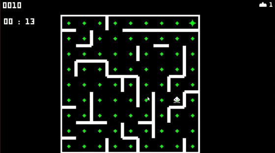
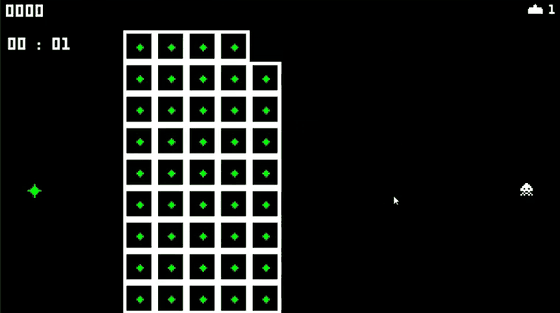
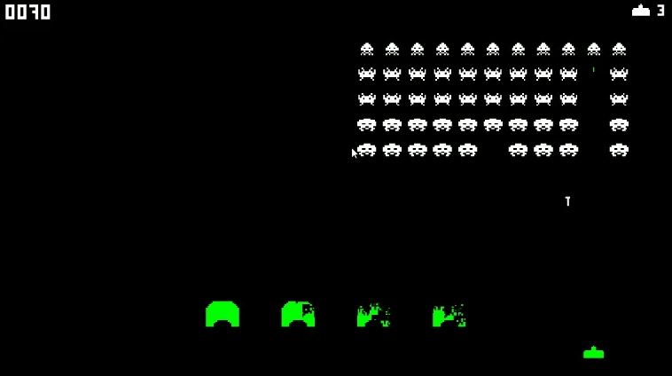
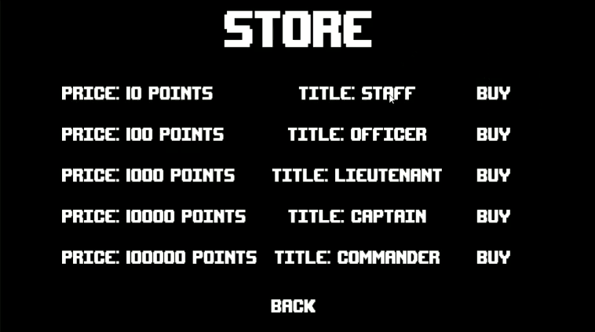
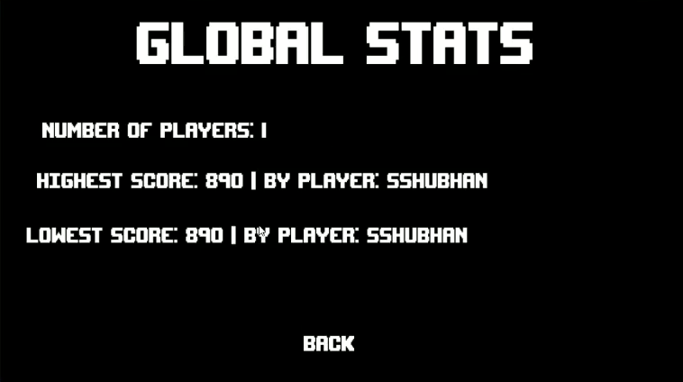

# Space Invaders+

A remake of the 1978 arcade game in Unity (C#) with a second, Pac-Man-style mode in which an invader chases you through a procedurally generated maze. It also has player accounts, a points-based title store and a persistent leaderboard backed by a PHP and MySQL server.

Built in 2024 as my AQA A-Level Computer Science Non-Exam Assessment.

| Maze mode: the red squares are the invader's planned route to the player | Maze generation, carved live with depth-first search |
| --- | --- |
|  |  |

| Invader mode | Title store | Global stats |
| --- | --- | --- |
|  |  |  |

## Features

**Invader mode** (the classic game)
- A 5 × 11 grid of invaders that speeds up as more of them are destroyed, worth 10, 20 or 30 points depending on type.
- Invaders fire from the column the player is under rather than at random, and their shots get faster as the wave thins out.
- A mystery ship crosses the screen every 30 seconds, worth 300 points.
- Bunkers take pixel-level damage from both sides' shots.

**Maze mode** (new)
- A new 9 × 9 maze is generated every game, and the player and invader spawn on random cells.
- The invader recalculates the shortest path to the player each time it reaches a new cell (and at least every 2 seconds), and gets faster as it collects pellets.
- The player has a 4-second head start, collects pellets for 10 points each, and can shoot in any of the four directions.
- Shooting the invader respawns it on a random cell. The round ends when you collect all 81 pellets or lose your single life.

**Accounts and progression**
- Registration and login, with salted, hashed passwords stored in MySQL.
- Points from both modes are saved to your account as you play.
- A store where points buy ranked titles (Staff, Officer, Lieutenant, Captain, Commander), with checks against buying a title twice or without enough points. Owning all five beats the game and unlocks a congratulations screen.
- A top-5 leaderboard, global stats (player count, highest and lowest scores) and a player stats page, all persisting across sessions.
- A home screen, pause menu, instructions, settings, and a welcome screen that greets you by your highest title.

## Tech stack

| Layer | Technology |
| --- | --- |
| Game client | Unity 2021.3 (C#) |
| Server | PHP scripts on Apache, run locally with XAMPP |
| Database | MySQL (3 tables: `users`, `titles` and the link table `userstitles`) |
| Client–server communication | HTTP POST/GET via `UnityWebRequest`, with JSON responses parsed by `JsonUtility` |

## How it works

### Maze generation: randomised depth-first search
`MazeGenerator.cs` starts with a full grid of walled cells and carves a maze using an explicit stack, an approach known as the "recursive backtracker":

1. Push a random starting cell onto the stack.
2. Look at the cell on top of the stack. If it has unvisited neighbours, pick one at random, remove the wall between them and push it.
3. If it has no unvisited neighbours, pop it and backtrack.
4. Repeat until every cell has been visited.

This produces a "perfect" maze, where there is exactly one route between any two cells. That makes it impossible to escape a chasing enemy, so the generator then knocks out 5 random interior walls to create loops. The generation runs as a coroutine, so the maze is carved on screen at the start of each game, as in the GIF above.

### Pathfinding
`Pathfinding.cs` runs a priority-queue shortest-path search from the player's cell outwards. For each cell it records the next step towards the player, then follows those steps from the invader's cell to build the route. Walls are checked between each pair of neighbours, so the invader can never cut through the maze.

The code names this method `AStar`, but its priority is the path cost so far with no distance heuristic. That makes it Dijkstra's algorithm, which on a 9 × 9 grid with equal move costs still returns the shortest path. Adding a Manhattan-distance heuristic would turn it into true A* and reduce the number of cells it explores.

### Client–server model
The Unity client never connects to the database directly. Each action (login, buying a title, updating points, fetching the leaderboard) is a request to a small PHP endpoint, which queries MySQL and returns JSON. Endpoints that take user input use prepared statements with bound parameters to protect against SQL injection (with one exception, listed under known limitations). Buying a title runs as a sequence of checks: does the user already own it, do they have enough points, then deduct the points and record the title.

### Design decisions
- **A separate server layer instead of a local save file.** A local file can't be shared between players, so a leaderboard and global stats would be impossible. A server also keeps database credentials out of the game client.
- **A link table for titles.** `userstitles` links users and titles many-to-many. One user can own several titles and one title can be owned by many users, without duplicating data.
- **Inheritance for maze projectiles.** `MazeProjectileU`, `MazeProjectileD`, `MazeProjectileL` and `MazeProjectileR` each extend `MazeProjectile` and set only their own direction, speed and spawn point. Collision handling is shared in the base class.
- **Singleton managers.** `GameManager`, `MazeManager` and `ScenesManager` expose a single static instance, so any script can report events such as an invader being killed without needing a reference wired up in the editor.

## Repository layout

```
Assets/Scripts/
├── Account/        # Registration, login, logout, password hashing, server calls (Web.cs)
├── InvaderMode/    # Classic mode: invader grid, mystery ship, bunkers, player
├── MazeMode/       # Maze generation, pathfinding, priority queue, maze player and invader
├── Store/          # Title store
├── Leaderboard/
├── Stats/          # Global and player statistics
└── UI/             # Menus, pause screen, scene loading
Server/             # PHP endpoints called by the client
Database/schema.sql # Table definitions and the store's titles
docs/design/        # Class diagram, ER diagram and flowcharts (open at app.diagrams.net)
docs/screenshots/
prototype-2023/     # The first Unity prototype: movement and shooting only
```

## Running it

**Note:** this repository contains the game's scripts, server and database, but not the original Unity scenes, sprites or prefabs, which were lost with the laptop the game was built on. The scripts were recovered from the project write-up. The setup below gets the server and database running. Playing the game also requires rebuilding the scenes in Unity and attaching these scripts.

1. Install [XAMPP](https://www.apachefriends.org/) and start **Apache** and **MySQL** from its control panel.
2. Open phpMyAdmin at `http://localhost/phpmyadmin`, go to the **SQL** tab and run `Database/schema.sql`. This creates the `spaceinvaders` database, its tables and the five store titles.
3. Copy the contents of `Server/` into a folder named `SpaceInvaders` inside XAMPP's `htdocs` folder. The client expects the scripts at `http://localhost/SpaceInvaders/`.
4. The PHP scripts connect with XAMPP's default local account (`root` with no password). If your MySQL setup differs, change `DB_USERNAME` and `DB_PASSWORD` at the top of each script.
5. Open a Unity 2021.3 project, copy `Assets/Scripts` into its `Assets` folder, and attach the scripts to your scene objects.

A few endpoint names in `Web.cs` differ from the recovered PHP file names (for example `LoginFP5.php` vs `LoginF.php`), and `fetchsaltfromdatabase.php` was not part of the write-up. Rename the files or update the URLs in `Web.cs` so they match.

## Known limitations

- **Password hashing** uses a simple custom string hash (in `PasswordManager.cs`) with a per-user salt, written to show how hashing works. A real deployment should use a slow, standard algorithm such as bcrypt via PHP's `password_hash`.
- **The priority queue** is a list scanned in full on every dequeue, which is O(n). A binary heap would make it O(log n). That's fine for 81 cells but wouldn't scale to large mazes.
- `getTitlesF.php` inserts the user ID straight into its query instead of using a prepared statement like the other endpoints that take input, which leaves it open to SQL injection.
